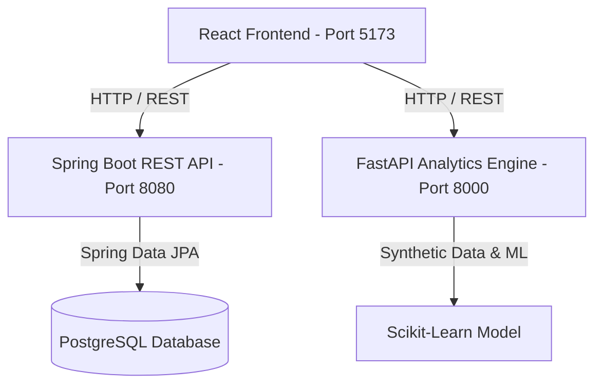

# System Architecture Documentation

## Overview

The Smart Rental Asset Tracking System utilizes a microservices-inspired architecture designed for high scalability, real-time telemetry processing, and predictive analytics.

## Core Component Modules

1. **Frontend Module (`frontend/`)**
   - Built with React 18, Vite, TypeScript, Material UI, and Tailwind CSS.
   - Handles interactive operator dashboards, asset catalog management, and telemetry visualization using Recharts.

2. **Backend Module (`backend/`)**
   - Built with Java 21, Spring Boot 3, Maven, and Spring Data JPA.
   - Manages business logic, asset inventory records, rental agreements, and PostgreSQL persistence.

3. **Analytics Module (`analytics/`)**
   - Built with Python 3.13, FastAPI, Pandas, NumPy, Scikit-Learn, and Faker.
   - Generates synthetic IoT telemetry data and predicts equipment failure risk flags.
